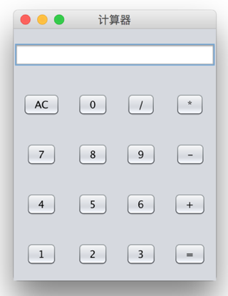

# Calculator

 

This is a simple calculator I've done two years ago.

It can do integer addition, subtraction, multiplication and division.

That's all, it would crash very often…

Since it's the first java program I've done, I just put here as a memory of mine.